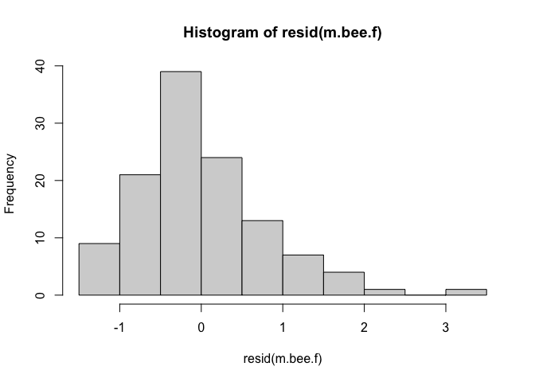
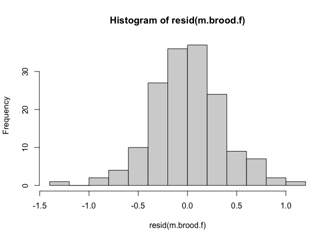

# Setup


```r
library(MASS)
library(tidyverse)
```

```
## ── Attaching packages ─────────────────────────────────────── tidyverse 1.3.2 ──
## ✔ ggplot2 3.4.1     ✔ purrr   1.0.1
## ✔ tibble  3.1.8     ✔ dplyr   1.1.0
## ✔ tidyr   1.3.0     ✔ stringr 1.5.0
## ✔ readr   2.1.4     ✔ forcats 1.0.0
## ── Conflicts ────────────────────────────────────────── tidyverse_conflicts() ──
## ✖ dplyr::filter() masks stats::filter()
## ✖ dplyr::lag()    masks stats::lag()
## ✖ dplyr::select() masks MASS::select()
```

```r
library(lme4)
```

```
## Loading required package: Matrix
## 
## Attaching package: 'Matrix'
## 
## The following objects are masked from 'package:tidyr':
## 
##     expand, pack, unpack
```

```r
library(boot)
library(emmeans)
library(broom)
library(DHARMa)
```

```
## This is DHARMa 0.4.6. For overview type '?DHARMa'. For recent changes, type news(package = 'DHARMa')
```

Vector of queen events

```r
# From "collated qlessness" sheet

# Any colonies that became queenless between day 0 and 42
qless <- c("D8", "RC1", "D21", "D24", "C6", "BC15")
```


```r
datum <- read.csv("../2 Analysis/data_prepped/datum_prepped.csv")
```


Data prep for phor, infest, bees modeling

```r
tempdatum <- datum %>% 
  filter(days %in% c(0,21,42),
         !(col_no %in% qless)
         ) %>%
  mutate(tot = wk_cells_infested_estimate + phoretic_mites_num_estimate,
           perc_of_mitepop_wkbrd = 100*wk_cells_infested_estimate/tot
           )
```


# Treatment Effects on Colony Strength
## Adult Bee Population

### Backwards variable testing starting from a priori model


```r
# A priori model (REML)
m.bee.a <- lmer(bees_frames ~ 
                 trt + 
                 days + 
                 trt:days +
                 (1 | col_no), data = tempdatum)
summary(m.bee.a) # 119 obs, 41 groups
```

```
## Linear mixed model fit by REML ['lmerMod']
## Formula: bees_frames ~ trt + days + trt:days + (1 | col_no)
##    Data: tempdatum
## 
## REML criterion at convergence: 405.7
## 
## Scaled residuals: 
##     Min      1Q  Median      3Q     Max 
## -1.5412 -0.5181 -0.1438  0.4612  2.8181 
## 
## Random effects:
##  Groups   Name        Variance Std.Dev.
##  col_no   (Intercept) 1.9357   1.3913  
##  Residual             0.9852   0.9926  
## Number of obs: 119, groups:  col_no, 41
## 
## Fixed effects:
##                        Estimate Std. Error t value
## (Intercept)              4.0271     0.4934   8.162
## trtApiguard_Api          0.4149     0.6723   0.617
## trtAEC                   0.2016     0.6619   0.305
## days21                  -0.7250     0.4052  -1.789
## days42                  -1.0478     0.4326  -2.422
## trtApiguard_Api:days21  -0.9411     0.5522  -1.704
## trtAEC:days21            0.7222     0.5437   1.328
## trtApiguard_Api:days42  -0.3616     0.5868  -0.616
## trtAEC:days42            0.9833     0.5644   1.742
## 
## Correlation of Fixed Effects:
##             (Intr) trtA_A trtAEC days21 days42 tA_A:2 tAEC:2 tA_A:4
## trtApgrd_Ap -0.734                                                 
## trtAEC      -0.745  0.547                                          
## days21      -0.411  0.301  0.306                                   
## days42      -0.385  0.282  0.287  0.468                            
## trtApg_A:21  0.301 -0.411 -0.225 -0.734 -0.344                     
## trtAEC:dy21  0.306 -0.225 -0.411 -0.745 -0.349  0.547              
## trtApg_A:42  0.284 -0.386 -0.211 -0.345 -0.737  0.471  0.257       
## trtAEC:dy42  0.295 -0.216 -0.396 -0.359 -0.767  0.263  0.482  0.565
```

```r
# Check deletion of interaction (ML)
m.bee.a.ML <- lmer(bees_frames ~ 
                 trt + 
                 days + 
                 trt:days +
                 (1 | col_no), data = tempdatum, REML = F)

m.bee.a0.ML <- lmer(bees_frames ~ 
                 trt + 
                 days + 
                 # trt:days +
                 (1 | col_no), data = tempdatum, REML = F)

anova(m.bee.a.ML, m.bee.a0.ML)
```

```
## Data: tempdatum
## Models:
## m.bee.a0.ML: bees_frames ~ trt + days + (1 | col_no)
## m.bee.a.ML: bees_frames ~ trt + days + trt:days + (1 | col_no)
##             npar    AIC    BIC  logLik deviance  Chisq Df Pr(>Chisq)  
## m.bee.a0.ML    7 430.49 449.94 -208.24   416.49                       
## m.bee.a.ML    11 426.39 456.96 -202.20   404.39 12.097  4    0.01664 *
## ---
## Signif. codes:  0 '***' 0.001 '**' 0.01 '*' 0.05 '.' 0.1 ' ' 1
```

```r
# The interaction of treatment and experiment day on adult bee population was significant (ChiSq[4]=12.097; P=0.01664) 
```

### Forward variable selection:

```r
# Check addition of a Varroa effect
m.bee.1.ML <- lmer(bees_frames ~ 
                 trt + 
                 days + 
                 trt:days +
                 pre_phor2 + 
                 (1 | col_no), data = tempdatum, REML = F)

anova(m.bee.1.ML, m.bee.a.ML)
```

```
## Data: tempdatum
## Models:
## m.bee.a.ML: bees_frames ~ trt + days + trt:days + (1 | col_no)
## m.bee.1.ML: bees_frames ~ trt + days + trt:days + pre_phor2 + (1 | col_no)
##            npar    AIC    BIC  logLik deviance Chisq Df Pr(>Chisq)    
## m.bee.a.ML   11 426.39 456.96 -202.20   404.39                        
## m.bee.1.ML   12 403.35 436.70 -189.68   379.35 25.04  1  5.615e-07 ***
## ---
## Signif. codes:  0 '***' 0.001 '**' 0.01 '*' 0.05 '.' 0.1 ' ' 1
```

```r
# the model fit was significantly improved by including the effect of day-0 infestation rate on bee population (ChiSq=25.04; P=5.615e-07)

# Check addition of a Varroa:days effect
m.bee.2.ML <- lmer(bees_frames ~ 
                 trt + 
                 days + 
                 trt:days +
                 pre_phor2 + 
                 pre_phor2:days +
                 (1 | col_no), data = tempdatum, REML = F)

anova(m.bee.1.ML, m.bee.2.ML)
```

```
## Data: tempdatum
## Models:
## m.bee.1.ML: bees_frames ~ trt + days + trt:days + pre_phor2 + (1 | col_no)
## m.bee.2.ML: bees_frames ~ trt + days + trt:days + pre_phor2 + pre_phor2:days + (1 | col_no)
##            npar    AIC    BIC  logLik deviance  Chisq Df Pr(>Chisq)  
## m.bee.1.ML   12 403.35 436.70 -189.68   379.35                       
## m.bee.2.ML   14 399.47 438.38 -185.74   371.47 7.8802  2    0.01945 *
## ---
## Signif. codes:  0 '***' 0.001 '**' 0.01 '*' 0.05 '.' 0.1 ' ' 1
```

```r
# The interaction of day-0 infestation rate and day on bee population also significantly improved model fit (ChiSq=7.8802, P=0.01945)

# Final model
m.bee.2 <- lmer(bees_frames ~ 
                 trt + 
                 days + 
                 trt:days +
                 pre_phor2 + 
                 pre_phor2:days +
                 (1 | col_no), data = tempdatum)

summary(m.bee.2)
```

```
## Linear mixed model fit by REML ['lmerMod']
## Formula: bees_frames ~ trt + days + trt:days + pre_phor2 + pre_phor2:days +  
##     (1 | col_no)
##    Data: tempdatum
## 
## REML criterion at convergence: 390.8
## 
## Scaled residuals: 
##     Min      1Q  Median      3Q     Max 
## -1.5655 -0.5228 -0.1046  0.3738  3.1572 
## 
## Random effects:
##  Groups   Name        Variance Std.Dev.
##  col_no   (Intercept) 0.9598   0.9797  
##  Residual             0.9133   0.9557  
## Number of obs: 119, groups:  col_no, 41
## 
## Fixed effects:
##                        Estimate Std. Error t value
## (Intercept)             5.04304    0.51385   9.814
## trtApiguard_Api         0.42582    0.53842   0.791
## trtAEC                  0.29953    0.53101   0.564
## days21                  0.06266    0.50742   0.123
## days42                 -0.30156    0.52804  -0.571
## pre_phor2              -0.10095    0.03265  -3.092
## trtApiguard_Api:days21 -0.93259    0.53169  -1.754
## trtAEC:days21           0.79810    0.52437   1.522
## trtApiguard_Api:days42 -0.39542    0.56362  -0.702
## trtAEC:days42           1.09260    0.54577   2.002
## days21:pre_phor2       -0.07827    0.03224  -2.428
## days42:pre_phor2       -0.07754    0.03470  -2.235
## 
## Correlation of Fixed Effects:
##             (Intr) trtA_A trtAEC days21 days42 pr_ph2 tA_A:2 tAEC:2 tA_A:4
## trtApgrd_Ap -0.560                                                        
## trtAEC      -0.534  0.546                                                 
## days21      -0.494  0.276  0.264                                          
## days42      -0.474  0.266  0.253  0.480                                   
## pre_phor2   -0.639 -0.007 -0.060  0.316  0.303                            
## trtApg_A:21  0.276 -0.494 -0.270 -0.560 -0.269  0.003                     
## trtAEC:dy21  0.264 -0.270 -0.494 -0.534 -0.257  0.029  0.546              
## trtApg_A:42  0.261 -0.466 -0.254 -0.264 -0.585  0.003  0.472  0.258       
## trtAEC:dy42  0.253 -0.259 -0.474 -0.256 -0.535  0.028  0.262  0.480  0.560
## dys21:pr_p2  0.316  0.003  0.029 -0.639 -0.307 -0.494 -0.007 -0.060 -0.003
## dys42:pr_p2  0.293  0.003  0.027 -0.297 -0.617 -0.459 -0.003 -0.028  0.008
##             tAEC:4 d21:_2
## trtApgrd_Ap              
## trtAEC                   
## days21                   
## days42                   
## pre_phor2                
## trtApg_A:21              
## trtAEC:dy21              
## trtApg_A:42              
## trtAEC:dy42              
## dys21:pr_p2 -0.029       
## dys42:pr_p2 -0.105  0.465
```

```r
m.bee.f <- m.bee.2
```


Interpret model

```r
summary(m.bee.f)
```

```
## Linear mixed model fit by REML ['lmerMod']
## Formula: bees_frames ~ trt + days + trt:days + pre_phor2 + pre_phor2:days +  
##     (1 | col_no)
##    Data: tempdatum
## 
## REML criterion at convergence: 390.8
## 
## Scaled residuals: 
##     Min      1Q  Median      3Q     Max 
## -1.5655 -0.5228 -0.1046  0.3738  3.1572 
## 
## Random effects:
##  Groups   Name        Variance Std.Dev.
##  col_no   (Intercept) 0.9598   0.9797  
##  Residual             0.9133   0.9557  
## Number of obs: 119, groups:  col_no, 41
## 
## Fixed effects:
##                        Estimate Std. Error t value
## (Intercept)             5.04304    0.51385   9.814
## trtApiguard_Api         0.42582    0.53842   0.791
## trtAEC                  0.29953    0.53101   0.564
## days21                  0.06266    0.50742   0.123
## days42                 -0.30156    0.52804  -0.571
## pre_phor2              -0.10095    0.03265  -3.092
## trtApiguard_Api:days21 -0.93259    0.53169  -1.754
## trtAEC:days21           0.79810    0.52437   1.522
## trtApiguard_Api:days42 -0.39542    0.56362  -0.702
## trtAEC:days42           1.09260    0.54577   2.002
## days21:pre_phor2       -0.07827    0.03224  -2.428
## days42:pre_phor2       -0.07754    0.03470  -2.235
## 
## Correlation of Fixed Effects:
##             (Intr) trtA_A trtAEC days21 days42 pr_ph2 tA_A:2 tAEC:2 tA_A:4
## trtApgrd_Ap -0.560                                                        
## trtAEC      -0.534  0.546                                                 
## days21      -0.494  0.276  0.264                                          
## days42      -0.474  0.266  0.253  0.480                                   
## pre_phor2   -0.639 -0.007 -0.060  0.316  0.303                            
## trtApg_A:21  0.276 -0.494 -0.270 -0.560 -0.269  0.003                     
## trtAEC:dy21  0.264 -0.270 -0.494 -0.534 -0.257  0.029  0.546              
## trtApg_A:42  0.261 -0.466 -0.254 -0.264 -0.585  0.003  0.472  0.258       
## trtAEC:dy42  0.253 -0.259 -0.474 -0.256 -0.535  0.028  0.262  0.480  0.560
## dys21:pr_p2  0.316  0.003  0.029 -0.639 -0.307 -0.494 -0.007 -0.060 -0.003
## dys42:pr_p2  0.293  0.003  0.027 -0.297 -0.617 -0.459 -0.003 -0.028  0.008
##             tAEC:4 d21:_2
## trtApgrd_Ap              
## trtAEC                   
## days21                   
## days42                   
## pre_phor2                
## trtApg_A:21              
## trtAEC:dy21              
## trtApg_A:42              
## trtAEC:dy42              
## dys21:pr_p2 -0.029       
## dys42:pr_p2 -0.105  0.465
```

```r
confint(m.bee.f)
```

```
## Computing profile confidence intervals ...
```

```
##                              2.5 %      97.5 %
## .sig01                  0.68403423  1.24762815
## .sigma                  0.78004007  1.06880835
## (Intercept)             4.07549805  6.01058380
## trtApiguard_Api        -0.58799192  1.43963639
## trtAEC                 -0.70032848  1.29937930
## days21                 -0.89151367  1.01682827
## days42                 -1.29217713  0.69434143
## pre_phor2              -0.16242922 -0.03948061
## trtApiguard_Api:days21 -1.93239157  0.06721395
## trtAEC:days21          -0.18793569  1.78413518
## trtApiguard_Api:days42 -1.45736368  0.66236249
## trtAEC:days42           0.06231353  2.11610984
## days21:pre_phor2       -0.13889360 -0.01764419
## days42:pre_phor2       -0.14270335 -0.01224334
```

### ANOVA of bees_frames within day


```r
joint_tests(m.bee.f, by = "days")
```

```
## days = 0:
##  model term df1   df2 F.ratio p.value
##  trt          2 71.27   0.325  0.7235
##  pre_phor2    1 71.27   9.562  0.0028
## 
## days = 21:
##  model term df1   df2 F.ratio p.value
##  trt          2 71.27   5.192  0.0079
##  pre_phor2    1 71.27  30.135  <.0001
## 
## days = 42:
##  model term df1   df2 F.ratio p.value
##  trt          2 77.46   4.516  0.0140
##  pre_phor2    1 82.37  25.838  <.0001
```

```r
# On day 0, no significant differences (F ratio 2,71.27=0.325, P=0.7235)
# On day 21, yes significant differences (F ratio 2,71.27=5.192, P=0.0079)
# On day 42, yes significant differences (F ratio 2,77.46=4.516, P=0.0140)
```


## Population of capped worker brood


```r
tempdatum <- datum %>% 
  filter(days %in% c(0,10,21,42),
         !(col_no %in% qless)
         )

tempdatum %>% 
  group_by(days, trt) %>% 
  summarize(n= n())
```

```
## `summarise()` has grouped output by 'days'. You can override using the
## `.groups` argument.
```

```
## # A tibble: 12 × 3
## # Groups:   days [4]
##    days  trt              n
##    <fct> <fct>        <int>
##  1 0     Apivar          12
##  2 0     Apiguard_Api    14
##  3 0     AEC             15
##  4 10    Apivar          12
##  5 10    Apiguard_Api    14
##  6 10    AEC             15
##  7 21    Apivar          12
##  8 21    Apiguard_Api    14
##  9 21    AEC             15
## 10 42    Apivar          10
## 11 42    Apiguard_Api    12
## 12 42    AEC             15
```

### Backward variable testing


```r
# A priori model (REML)
m.brood.a <- lmer(wk_frames ~ 
                   trt + 
                   days + 
                   trt:days + 
                  (1 | col_no), 
                 data = tempdatum)
summary(m.brood.a)
```

```
## Linear mixed model fit by REML ['lmerMod']
## Formula: wk_frames ~ trt + days + trt:days + (1 | col_no)
##    Data: tempdatum
## 
## REML criterion at convergence: 233.6
## 
## Scaled residuals: 
##      Min       1Q   Median       3Q      Max 
## -3.11352 -0.54750 -0.07891  0.53231  2.66164 
## 
## Random effects:
##  Groups   Name        Variance Std.Dev.
##  col_no   (Intercept) 0.1000   0.3163  
##  Residual             0.1695   0.4117  
## Number of obs: 160, groups:  col_no, 41
## 
## Fixed effects:
##                        Estimate Std. Error t value
## (Intercept)             2.41771    0.14988  16.131
## trtApiguard_Api         0.26086    0.20425   1.277
## trtAEC                  0.23729    0.20108   1.180
## days10                 -1.28125    0.16809  -7.622
## days21                 -1.17708    0.16809  -7.003
## days42                 -1.74536    0.17799  -9.806
## trtApiguard_Api:days10 -0.66250    0.22907  -2.892
## trtAEC:days10          -0.17708    0.22552  -0.785
## trtApiguard_Api:days21 -0.16667    0.22907  -0.728
## trtAEC:days21          -0.10042    0.22552  -0.445
## trtApiguard_Api:days42 -0.32487    0.24155  -1.345
## trtAEC:days42          -0.08797    0.23299  -0.378
## 
## Correlation of Fixed Effects:
##             (Intr) trtA_A trtAEC days10 days21 days42 tA_A:1 tAEC:1 tA_A:2
## trtApgrd_Ap -0.734                                                        
## trtAEC      -0.745  0.547                                                 
## days10      -0.561  0.411  0.418                                          
## days21      -0.561  0.411  0.418  0.500                                   
## days42      -0.530  0.389  0.395  0.472  0.472                            
## trtApg_A:10  0.411 -0.561 -0.307 -0.734 -0.367 -0.346                     
## trtAEC:dy10  0.418 -0.307 -0.561 -0.745 -0.373 -0.352  0.547              
## trtApg_A:21  0.411 -0.561 -0.307 -0.367 -0.734 -0.346  0.500  0.273       
## trtAEC:dy21  0.418 -0.307 -0.561 -0.373 -0.745 -0.352  0.273  0.500  0.547
## trtApg_A:42  0.390 -0.532 -0.291 -0.348 -0.348 -0.737  0.474  0.259  0.474
## trtAEC:dy42  0.405 -0.297 -0.543 -0.361 -0.361 -0.764  0.265  0.484  0.265
##             tAEC:2 tA_A:4
## trtApgrd_Ap              
## trtAEC                   
## days10                   
## days21                   
## days42                   
## trtApg_A:10              
## trtAEC:dy10              
## trtApg_A:21              
## trtAEC:dy21              
## trtApg_A:42  0.259       
## trtAEC:dy42  0.484  0.563
```

```r
# Check deletion of interaction (ML)
m.brood.a0 <- lmer(wk_frames ~ 
                   trt + 
                   days + 
                   # trt:days + 
                  (1 | col_no), 
                 data = tempdatum)

anova(m.brood.a, m.brood.a0)
```

```
## refitting model(s) with ML (instead of REML)
```

```
## Data: tempdatum
## Models:
## m.brood.a0: wk_frames ~ trt + days + (1 | col_no)
## m.brood.a: wk_frames ~ trt + days + trt:days + (1 | col_no)
##            npar    AIC    BIC  logLik deviance  Chisq Df Pr(>Chisq)  
## m.brood.a0    8 233.31 257.91 -108.66   217.31                       
## m.brood.a    14 234.55 277.60 -103.27   206.55 10.766  6    0.09588 .
## ---
## Signif. codes:  0 '***' 0.001 '**' 0.01 '*' 0.05 '.' 0.1 ' ' 1
```

```r
# We did not find a significant interaction between treatment and days on worker brood population (ChiSq[6]=10.766; P=0.09588), but because of our experiment designed to examine this effect, we retained the interaction in the model anyway.

# Check deletion of trt, then days

m.brood.a00 <- lmer(wk_frames ~ 
                   # trt + 
                   days + 
                   # trt:days + 
                  (1 | col_no), 
                 data = tempdatum)

anova(m.brood.a0, m.brood.a00)
```

```
## refitting model(s) with ML (instead of REML)
```

```
## Data: tempdatum
## Models:
## m.brood.a00: wk_frames ~ days + (1 | col_no)
## m.brood.a0: wk_frames ~ trt + days + (1 | col_no)
##             npar    AIC    BIC  logLik deviance  Chisq Df Pr(>Chisq)
## m.brood.a00    6 231.15 249.60 -109.57   219.15                     
## m.brood.a0     8 233.31 257.91 -108.66   217.31 1.8358  2     0.3994
```

```r
# Effect of trt not significant (Chisq[2] = 1.84, P=0.3994)


# Check deletion of days
m.brood.a000 <- lmer(wk_frames ~ 
                   trt + 
                   # days + 
                   # trt:days + 
                  (1 | col_no), 
                 data = tempdatum)
```

```
## boundary (singular) fit: see help('isSingular')
```

```r
# Singular fit, but this isn't a model I'm deriving estimates from.

anova(m.brood.a0, m.brood.a000)
```

```
## refitting model(s) with ML (instead of REML)
```

```
## Data: tempdatum
## Models:
## m.brood.a000: wk_frames ~ trt + (1 | col_no)
## m.brood.a0: wk_frames ~ trt + days + (1 | col_no)
##              npar    AIC    BIC  logLik deviance  Chisq Df Pr(>Chisq)    
## m.brood.a000    5 419.66 435.04 -204.83   409.66                         
## m.brood.a0      8 233.31 257.91 -108.66   217.31 192.35  3  < 2.2e-16 ***
## ---
## Signif. codes:  0 '***' 0.001 '**' 0.01 '*' 0.05 '.' 0.1 ' ' 1
```

```r
# Significant effect of days (Chisq[3]=192.35, P<2.2e-16).
```

### Forward variable selection


```r
# Check addition of a Varroa effect
m.brood.1 <- lmer(wk_frames ~ 
                   trt + 
                   days + 
                   trt:days + 
                   pre_phor2 +
                  (1 | col_no), 
                 data = tempdatum)

anova(m.brood.a, m.brood.1)
```

```
## refitting model(s) with ML (instead of REML)
```

```
## Data: tempdatum
## Models:
## m.brood.a: wk_frames ~ trt + days + trt:days + (1 | col_no)
## m.brood.1: wk_frames ~ trt + days + trt:days + pre_phor2 + (1 | col_no)
##           npar    AIC    BIC  logLik deviance  Chisq Df Pr(>Chisq)    
## m.brood.a   14 234.55 277.60 -103.27   206.55                         
## m.brood.1   15 222.78 268.91  -96.39   192.78 13.767  1   0.000207 ***
## ---
## Signif. codes:  0 '***' 0.001 '**' 0.01 '*' 0.05 '.' 0.1 ' ' 1
```

```r
# The addition of Varroa was highly significant (ChiSq[1]=13.767, P=0.000207)


# Check addition of a Varroa:days effect
m.brood.2 <- lmer(wk_frames ~ 
                   trt + 
                   days + 
                   trt:days + 
                   pre_phor2 +
                   pre_phor2:days +
                  (1 | col_no), 
                 data = tempdatum)
anova(m.brood.2, m.brood.1)
```

```
## refitting model(s) with ML (instead of REML)
```

```
## Data: tempdatum
## Models:
## m.brood.1: wk_frames ~ trt + days + trt:days + pre_phor2 + (1 | col_no)
## m.brood.2: wk_frames ~ trt + days + trt:days + pre_phor2 + pre_phor2:days + (1 | col_no)
##           npar    AIC    BIC  logLik deviance Chisq Df Pr(>Chisq)  
## m.brood.1   15 222.78 268.91 -96.390   192.78                      
## m.brood.2   18 221.85 277.21 -92.927   185.85 6.926  3    0.07429 .
## ---
## Signif. codes:  0 '***' 0.001 '**' 0.01 '*' 0.05 '.' 0.1 ' ' 1
```

```r
# The addition of Varroa:days was not significant (ChiSq[3]=6.926, P=0.07429)

# Now that have added a Varroa effect, test deletion of the treatment:days interaction backwards

m.brood.3 <- lmer(wk_frames ~ 
                   trt + 
                   days + 
                   # trt:days + 
                   pre_phor2 +
                  (1 | col_no), 
                 data = tempdatum)

anova(m.brood.3, m.brood.1)
```

```
## refitting model(s) with ML (instead of REML)
```

```
## Data: tempdatum
## Models:
## m.brood.3: wk_frames ~ trt + days + pre_phor2 + (1 | col_no)
## m.brood.1: wk_frames ~ trt + days + trt:days + pre_phor2 + (1 | col_no)
##           npar    AIC    BIC  logLik deviance  Chisq Df Pr(>Chisq)  
## m.brood.3    9 221.54 249.22 -101.77   203.54                       
## m.brood.1   15 222.78 268.91  -96.39   192.78 10.759  6    0.09612 .
## ---
## Signif. codes:  0 '***' 0.001 '**' 0.01 '*' 0.05 '.' 0.1 ' ' 1
```

```r
# Also in the presence of the pre_Varroa effect, there is a P=0.096 effect of


# Check that the effect estimate of trt:time is robust to the addition of the pre_Varroa effect
s.1 <- summary(m.brood.a)
s.2<- data.frame(s.1$coefficients)
s.3 <- data.frame(confint(m.brood.a))[3:14,]
```

```
## Computing profile confidence intervals ...
```

```r
s.4 <- cbind(s.2, s.3)

# Now estimates for model including the pre_Varroa effect
s.5 <- summary(m.brood.1)
s.6 <- data.frame(s.5$coefficients)[-7,]

# Bind together
s.7 <- cbind(s.4, s.6)

# The estimates of treatment effect are remarkably similar with the addition of pre_Varroa as a predictor of brood area. Only the new estimate of the intercept moved outside the bounds of the original 95% CI, and all the others stayed remarkably similar.

anova(m.brood.1)
```

```
## Analysis of Variance Table
##           npar Sum Sq Mean Sq  F value
## trt          2  0.254  0.1269   0.7466
## days         3 81.480 27.1601 159.8331
## pre_phor2    1  2.500  2.5005  14.7150
## trt:days     6  1.773  0.2954   1.7386
```


```r
# Final model

# Preferred model: m.brood.1.ML
m.brood.1 <- lmer(wk_frames ~ 
                   trt + 
                   days + 
                   trt:days + 
                   pre_phor2 +
                   # pre_phor2:days +
                  (1 | col_no), 
                 data = tempdatum)

summary(m.brood.1)
```

```
## Linear mixed model fit by REML ['lmerMod']
## Formula: wk_frames ~ trt + days + trt:days + pre_phor2 + (1 | col_no)
##    Data: tempdatum
## 
## REML criterion at convergence: 228.8
## 
## Scaled residuals: 
##     Min      1Q  Median      3Q     Max 
## -3.1716 -0.5641  0.0015  0.5377  2.6034 
## 
## Random effects:
##  Groups   Name        Variance Std.Dev.
##  col_no   (Intercept) 0.06101  0.2470  
##  Residual             0.16993  0.4122  
## Number of obs: 160, groups:  col_no, 41
## 
## Fixed effects:
##                         Estimate Std. Error t value
## (Intercept)             2.717902   0.159216  17.071
## trtApiguard_Api         0.264096   0.189053   1.397
## trtAEC                  0.266231   0.186272   1.429
## days10                 -1.281250   0.168289  -7.613
## days21                 -1.177083   0.168289  -6.994
## days42                 -1.745565   0.177920  -9.811
## pre_phor2              -0.029830   0.007764  -3.842
## trtApiguard_Api:days10 -0.662500   0.229340  -2.889
## trtAEC:days10          -0.177083   0.225784  -0.784
## trtApiguard_Api:days21 -0.166667   0.229340  -0.727
## trtAEC:days21          -0.100417   0.225784  -0.445
## trtApiguard_Api:days42 -0.330891   0.241439  -1.370
## trtAEC:days42          -0.087769   0.233051  -0.377
```

```
## 
## Correlation matrix not shown by default, as p = 13 > 12.
## Use print(x, correlation=TRUE)  or
##     vcov(x)        if you need it
```

```r
confint(m.brood.1)
```

```
## Computing profile confidence intervals ...
```

```
##                              2.5 %      97.5 %
## .sig01                  0.13794247  0.33506840
## .sigma                  0.35063378  0.45327941
## (Intercept)             2.41723093  3.01862895
## trtApiguard_Api        -0.09273667  0.62092870
## trtAEC                 -0.08535270  0.61781572
## days10                 -1.60110090 -0.96139910
## days21                 -1.49693423 -0.85723244
## days42                 -2.08195897 -1.40480727
## pre_phor2              -0.04463934 -0.01504176
## trtApiguard_Api:days10 -1.09838330 -0.22661670
## trtAEC:days10          -0.60620834  0.25204167
## trtApiguard_Api:days21 -0.60254996  0.26921663
## trtAEC:days21          -0.52954167  0.32870834
## trtApiguard_Api:days42 -0.79012462  0.12733939
## trtAEC:days42          -0.53323193  0.35328272
```

```r
# Final model is m.brood.1
m.brood.f <- m.brood.1
```


# Look at residuals of preferred models


```r
hist(resid(m.bee.f)) # Not too off from normal dist
```

<!-- -->

```r
hist(resid(m.brood.f)) # Looks pretty normal
```

<!-- -->

### No need to do ANOVA of wk_frames within day
- Because the interaction wasn't significant


# Tidy the output of models
To be able to report predicted response


```r
# Bees

emres_bees<- emmeans(m.bee.f, pairwise ~ trt | days, type = "response")$emmeans %>% 
  tidy()

emmeans(m.bee.f, pairwise ~ trt | days, type = "response")$contrasts
```

```
## days = 0:
##  contrast              estimate    SE   df t.ratio p.value
##  Apivar - Apiguard_Api  -0.4258 0.538 71.3  -0.791  0.7098
##  Apivar - AEC           -0.2995 0.531 71.3  -0.564  0.8396
##  Apiguard_Api - AEC      0.1263 0.509 71.3   0.248  0.9667
## 
## days = 21:
##  contrast              estimate    SE   df t.ratio p.value
##  Apivar - Apiguard_Api   0.5068 0.538 71.3   0.941  0.6162
##  Apivar - AEC           -1.0976 0.531 71.3  -2.067  0.1041
##  Apiguard_Api - AEC     -1.6044 0.509 71.3  -3.150  0.0067
## 
## days = 42:
##  contrast              estimate    SE   df t.ratio p.value
##  Apivar - Apiguard_Api  -0.0304 0.570 80.2  -0.053  0.9984
##  Apivar - AEC           -1.3921 0.552 77.5  -2.520  0.0364
##  Apiguard_Api - AEC     -1.3617 0.527 76.6  -2.584  0.0310
## 
## Degrees-of-freedom method: kenward-roger 
## P value adjustment: tukey method for comparing a family of 3 estimates
```

```r
confint(emmeans(m.bee.f, pairwise ~ trt | days, type = "response"))$contrasts
```

```
## days = 0:
##  contrast              estimate    SE   df lower.CL upper.CL
##  Apivar - Apiguard_Api  -0.4258 0.538 71.3   -1.715   0.8630
##  Apivar - AEC           -0.2995 0.531 71.3   -1.571   0.9715
##  Apiguard_Api - AEC      0.1263 0.509 71.3   -1.093   1.3455
## 
## days = 21:
##  contrast              estimate    SE   df lower.CL upper.CL
##  Apivar - Apiguard_Api   0.5068 0.538 71.3   -0.782   1.7956
##  Apivar - AEC           -1.0976 0.531 71.3   -2.369   0.1734
##  Apiguard_Api - AEC     -1.6044 0.509 71.3   -2.824  -0.3851
## 
## days = 42:
##  contrast              estimate    SE   df lower.CL upper.CL
##  Apivar - Apiguard_Api  -0.0304 0.570 80.2   -1.393   1.3319
##  Apivar - AEC           -1.3921 0.552 77.5   -2.712  -0.0719
##  Apiguard_Api - AEC     -1.3617 0.527 76.6   -2.621  -0.1020
## 
## Degrees-of-freedom method: kenward-roger 
## Confidence level used: 0.95 
## Conf-level adjustment: tukey method for comparing a family of 3 estimates
```

```r
## Day 42 frames of bees estimates
### AEC 4.292991
### Apivar 2.912365
### Combination 2.951125

## What percentage of bees were lacking in Apivar?
100*(4.292991-2.912365)/4.292991 #32%
```

```
## [1] 32.16
```

```r
# 1.38 missing frames of bees. Convert to number of bees
# Beebook reference
2430*1.38 # 3353
```

```
## [1] 3353.4
```

```r
## What percentage of bees were lacking in Combination?
100*(4.292991-2.951125)/4.292991 # 31%
```

```
## [1] 31.25714
```

```r
## Combination missing 1.34 frames of bees. Convert to number of bees
## Beebook conversion
2430*1.34 # 3256 bees missing
```

```
## [1] 3256.2
```

```r
## Combination missing how many frames of brood on Day 10?
1.2-0.73 # 0.47 frames of brood
```

```
## [1] 0.47
```

```r
880*3.8*2 # 6688 cells of worker brood per frame
```

```
## [1] 6688
```

```r
## Combination missing 0.47 frames of brood on Day 10. Convert to number of bees
6688*0.47 #3143 brood missing
```

```
## [1] 3143.36
```

```r
# Bees a priori

emres_bees_apriori<- emmeans(m.bee.a, pairwise ~ trt | days, type = "response")$emmeans %>% 
  tidy()

emmeans(m.bee.a, pairwise ~ trt | days, type = "response")$contrasts
```

```
## days = 0:
##  contrast              estimate    SE   df t.ratio p.value
##  Apivar - Apiguard_Api  -0.4149 0.672 59.9  -0.617  0.8114
##  Apivar - AEC           -0.2016 0.662 59.9  -0.305  0.9502
##  Apiguard_Api - AEC      0.2133 0.635 59.9   0.336  0.9398
## 
## days = 21:
##  contrast              estimate    SE   df t.ratio p.value
##  Apivar - Apiguard_Api   0.5262 0.672 59.9   0.783  0.7151
##  Apivar - AEC           -0.9237 0.662 59.9  -1.396  0.3497
##  Apiguard_Api - AEC     -1.4499 0.635 59.9  -2.283  0.0660
## 
## days = 42:
##  contrast              estimate    SE   df t.ratio p.value
##  Apivar - Apiguard_Api  -0.0532 0.701 67.4  -0.076  0.9968
##  Apivar - AEC           -1.1849 0.679 64.5  -1.745  0.1967
##  Apiguard_Api - AEC     -1.1317 0.648 63.5  -1.746  0.1962
## 
## Degrees-of-freedom method: kenward-roger 
## P value adjustment: tukey method for comparing a family of 3 estimates
```

```r
confint(emmeans(m.bee.a, pairwise ~ trt | days, type = "response"))$contrasts
```

```
## days = 0:
##  contrast              estimate    SE   df lower.CL upper.CL
##  Apivar - Apiguard_Api  -0.4149 0.672 59.9    -2.03   1.2010
##  Apivar - AEC           -0.2016 0.662 59.9    -1.79   1.3892
##  Apiguard_Api - AEC      0.2133 0.635 59.9    -1.31   1.7397
## 
## days = 21:
##  contrast              estimate    SE   df lower.CL upper.CL
##  Apivar - Apiguard_Api   0.5262 0.672 59.9    -1.09   2.1421
##  Apivar - AEC           -0.9237 0.662 59.9    -2.51   0.6671
##  Apiguard_Api - AEC     -1.4499 0.635 59.9    -2.98   0.0764
## 
## days = 42:
##  contrast              estimate    SE   df lower.CL upper.CL
##  Apivar - Apiguard_Api  -0.0532 0.701 67.4    -1.73   1.6275
##  Apivar - AEC           -1.1849 0.679 64.5    -2.81   0.4445
##  Apiguard_Api - AEC     -1.1317 0.648 63.5    -2.69   0.4235
## 
## Degrees-of-freedom method: kenward-roger 
## Confidence level used: 0.95 
## Conf-level adjustment: tukey method for comparing a family of 3 estimates
```

```r
# Brood


emres_brood<- emmeans(m.brood.f, pairwise ~ trt | days, type = "response")$emmeans %>% 
  tidy()

emmeans(m.brood.f, pairwise ~ trt | days, type = "response")$contrasts
```

```
## days = 0:
##  contrast              estimate    SE  df t.ratio p.value
##  Apivar - Apiguard_Api -0.26410 0.189 121  -1.397  0.3457
##  Apivar - AEC          -0.26623 0.186 121  -1.429  0.3292
##  Apiguard_Api - AEC    -0.00214 0.179 121  -0.012  0.9999
## 
## days = 10:
##  contrast              estimate    SE  df t.ratio p.value
##  Apivar - Apiguard_Api  0.39840 0.189 121   2.107  0.0926
##  Apivar - AEC          -0.08915 0.186 121  -0.479  0.8815
##  Apiguard_Api - AEC    -0.48755 0.179 121  -2.728  0.0199
## 
## days = 21:
##  contrast              estimate    SE  df t.ratio p.value
##  Apivar - Apiguard_Api -0.09743 0.189 121  -0.515  0.8640
##  Apivar - AEC          -0.16581 0.186 121  -0.890  0.6475
##  Apiguard_Api - AEC    -0.06839 0.179 121  -0.383  0.9225
## 
## days = 42:
##  contrast              estimate    SE  df t.ratio p.value
##  Apivar - Apiguard_Api  0.06679 0.204 130   0.328  0.9425
##  Apivar - AEC          -0.17846 0.195 127  -0.914  0.6326
##  Apiguard_Api - AEC    -0.24526 0.186 126  -1.322  0.3858
## 
## Degrees-of-freedom method: kenward-roger 
## P value adjustment: tukey method for comparing a family of 3 estimates
```

```r
confint(emmeans(m.brood.f, pairwise ~ trt | days, type = "response"))$contrasts
```

```
## days = 0:
##  contrast              estimate    SE  df lower.CL upper.CL
##  Apivar - Apiguard_Api -0.26410 0.189 121  -0.7127   0.1845
##  Apivar - AEC          -0.26623 0.186 121  -0.7083   0.1758
##  Apiguard_Api - AEC    -0.00214 0.179 121  -0.4262   0.4219
## 
## days = 10:
##  contrast              estimate    SE  df lower.CL upper.CL
##  Apivar - Apiguard_Api  0.39840 0.189 121  -0.0502   0.8470
##  Apivar - AEC          -0.08915 0.186 121  -0.5312   0.3529
##  Apiguard_Api - AEC    -0.48755 0.179 121  -0.9116  -0.0635
## 
## days = 21:
##  contrast              estimate    SE  df lower.CL upper.CL
##  Apivar - Apiguard_Api -0.09743 0.189 121  -0.5460   0.3512
##  Apivar - AEC          -0.16581 0.186 121  -0.6078   0.2762
##  Apiguard_Api - AEC    -0.06839 0.179 121  -0.4925   0.3557
## 
## days = 42:
##  contrast              estimate    SE  df lower.CL upper.CL
##  Apivar - Apiguard_Api  0.06679 0.204 130  -0.4163   0.5499
##  Apivar - AEC          -0.17846 0.195 127  -0.6416   0.2847
##  Apiguard_Api - AEC    -0.24526 0.186 126  -0.6854   0.1949
## 
## Degrees-of-freedom method: kenward-roger 
## Confidence level used: 0.95 
## Conf-level adjustment: tukey method for comparing a family of 3 estimates
```

```r
# Note that the inclusion of day:trt effect in the overall model was not significant.
```

# Summarize models for plotting


```r
emplot_bees <- emmip(m.bee.f, trt~days, type = "response", CIs = TRUE, plotit = FALSE)
emplot_bees$days <- as.numeric(as.character(emplot_bees$days))
emplot_bees$trt <- factor(emplot_bees$trt, levels = c("Apivar", "AEC", "Apiguard_Api"))
levels(emplot_bees$trt) # check order of factors
```

```
## [1] "Apivar"       "AEC"          "Apiguard_Api"
```

```r
emplot_bees_apriori <- emmip(m.bee.a, trt~days, type = "response", CIs = TRUE, plotit = FALSE)
emplot_bees_apriori$days <- as.numeric(as.character(emplot_bees_apriori$days))
emplot_bees_apriori$trt <- factor(emplot_bees_apriori$trt, levels = c("Apivar", "AEC", "Apiguard_Api"))
levels(emplot_bees_apriori$trt) # check order of factors
```

```
## [1] "Apivar"       "AEC"          "Apiguard_Api"
```

```r
emplot_brood <- emmip(m.brood.f, trt~days, type = "response", CIs = TRUE, plotit = FALSE)
emplot_brood$days <- as.numeric(as.character(emplot_brood$days))
emplot_brood$trt <- factor(emplot_brood$trt, levels = c("Apivar", "AEC", "Apiguard_Api"))
levels(emplot_brood$trt) # check order of factors
```

```
## [1] "Apivar"       "AEC"          "Apiguard_Api"
```


# Save these summarized tables of model estimates to their own CSVs


```r
write.csv(emplot_bees, "../3 Plotting/data_analyzed/emplot_bees.csv")
write.csv(emplot_brood, "../3 Plotting/data_analyzed/emplot_brood.csv")
```

