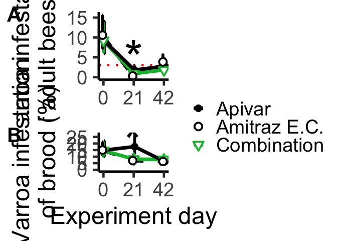
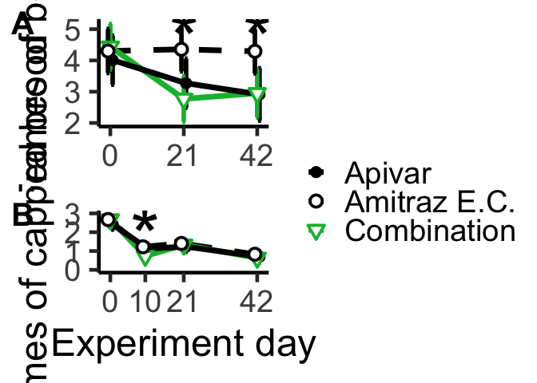

# Setup


```r
library(tidyverse)
```

```
## ── Attaching packages ─────────────────────────────────────── tidyverse 1.3.2 ──
## ✔ ggplot2 3.4.1     ✔ purrr   1.0.1
## ✔ tibble  3.1.8     ✔ dplyr   1.1.0
## ✔ tidyr   1.3.0     ✔ stringr 1.5.0
## ✔ readr   2.1.4     ✔ forcats 1.0.0
## ── Conflicts ────────────────────────────────────────── tidyverse_conflicts() ──
## ✖ dplyr::filter() masks stats::filter()
## ✖ dplyr::lag()    masks stats::lag()
```

```r
library(ggpubr)
```

Required to read in


```r
emplot_phor <- read.csv("./data_analyzed/emplot_phor.csv")
emplot_infest <- read.csv("./data_analyzed/emplot_infest.csv")
emplot_bees <- read.csv("./data_analyzed/emplot_bees.csv")
emplot_brood <- read.csv("./data_analyzed/emplot_brood.csv")
emplot_prop <- read.csv("./data_analyzed/emplot_prop.csv")
```


# Combining plots

Trying to save as TIFFs
80mm wide
60mm tall
600 dpi

## Use ggarrange to make combo plots for Varroa parameters

```r
# VARROA
pd <- position_dodge(2)

p1a <- emplot_phor %>% 
ggplot(mapping = aes(y = yvar, x = days, color = trt)) +
  scale_colour_manual(
    limits = c("Apivar", "AEC", "Apiguard_Api"),
    labels = c("Apivar", "Amitraz E.C.", "Combination"),
    values = c("black", "black", "#00BA38"), 
    aesthetics = "color"
  ) +

  scale_linetype_manual(
    limits = c("Apivar", "AEC", "Apiguard_Api"),
    labels = c("Apivar", "Amitraz E.C.", "Combination"),
    values=c("solid", "dashed", "solid")
    ) +
  
  scale_shape_manual(
    limits = c("Apivar", "AEC", "Apiguard_Api"),
    labels = c("Apivar", "Amitraz E.C.", "Combination"),
    values = c(16, 21, 25)) +  
  
  geom_hline(yintercept = 3, colour = "red", size = 1.5, linetype = "dotted") + # , alpha = 0.7
  geom_line(aes(linetype = trt), position=pd, size = 2.5) + 
  geom_errorbar(aes(ymin=LCL, ymax=UCL), width=2.5, position=pd, size = 2) +
  geom_point(aes(shape=trt), position=pd, fill="white", size = 4, stroke = 2) +
  annotate("text", x=21, y=5, label= "*", size = 25) +
  scale_x_continuous(breaks = c(0, 21, 42)) +
  theme_classic(base_size = 36) +
  ylab("Varroa infestation\nof adult bees (%)") + # Varroa /\n100 bees
  # xlab("Experiment day") +
  theme(legend.position = "right", axis.title.x = element_blank(), legend.title=element_blank())
```

```
## Warning: Using `size` aesthetic for lines was deprecated in ggplot2 3.4.0.
## ℹ Please use `linewidth` instead.
```

```r
p1b <- emplot_infest %>% 
ggplot(mapping = aes(y = yvar/2, x = days, color = trt)) +  
  scale_colour_manual(
    limits = c("Apivar", "AEC", "Apiguard_Api"),
    labels = c("Apivar", "Amitraz E.C.", "Combination"),
    values = c("black", "black", "#00BA38"), 
    aesthetics = "color"
  ) +

  scale_linetype_manual(
    limits = c("Apivar", "AEC", "Apiguard_Api"),
    labels = c("Apivar", "Amitraz E.C.", "Combination"),
    values=c("solid", "dashed", "solid")
    ) +
  
  scale_shape_manual(
    limits = c("Apivar", "AEC", "Apiguard_Api"),
    labels = c("Apivar", "Amitraz E.C.", "Combination"),
    values = c(16, 21, 25)) +  
  
  geom_line(aes(linetype = trt), position=pd, size = 2.5) +
  geom_errorbar(aes(ymin=LCL/2, ymax=UCL/2), width=2.5, position=pd, size = 2) +
  geom_point(aes(shape=trt), position=pd, fill="white", size = 4, stroke = 2) +
  annotate("text", x=20.5, y=22, label= "*", size = 25) +
  
  scale_x_continuous(breaks = c(0, 21, 42)) +
  scale_y_continuous(limits = c(0,27), breaks = c(0,5,10,15,20,25)) +
  theme_classic(base_size = 36) +
  
  ylab("Varroa infestation\nof brood (%)") + # Varroa-infested cells /\n100 cells
  xlab("Experiment day") +
  theme(legend.position = "right", legend.title=element_blank())


ggarrange(p1a, p1b, ncol = 1, nrow = 2, labels = "AUTO", font.label = list(size = 30), common.legend = TRUE, legend = "right")
```

<!-- -->

```r
ggsave("outputs/2023-05-20_tiff_combo/varroa 2023-05-22.tiff", width = 16, height = 17.25, units = "in")
```

## Use ggarrange to make combo plots for colony strength parameters

Graphical settings in 2023-05-02 versions of these graphs:


```r
# STRENGTH
p2a <- emplot_bees %>% 
ggplot(mapping = aes(y = yvar, x = days, color = trt)) +  
  # , group = trt probably not necessary
  scale_colour_manual(
    limits = c("Apivar", "AEC", "Apiguard_Api"),
    labels = c("Apivar", "Amitraz E.C.", "Combination"),
    values = c("black", "black", "#00BA38"), 
    aesthetics = "color"
  ) +

  scale_linetype_manual(
    limits = c("Apivar", "AEC", "Apiguard_Api"),
    labels = c("Apivar", "Amitraz E.C.", "Combination"),
    values=c("solid", "dashed", "solid")
    ) +
  
  scale_shape_manual(
    limits = c("Apivar", "AEC", "Apiguard_Api"),
    labels = c("Apivar", "Amitraz E.C.", "Combination"),
    values = c(16, 21, 25)) +  
  
  geom_line(aes(linetype = trt), position=pd, size = 2.5) +
  geom_errorbar(aes(ymin=LCL, ymax=UCL), width=2.5, position=pd, size = 2) +
  geom_point(aes(shape=trt), position=pd, fill="white", size = 4, stroke = 2) +
  
  annotate("text", x=21.2, y=4.7, label= "*", size = 25) +
  annotate("text", x=42.2, y=4.7, label= "*", size = 25) +
  
  scale_x_continuous(breaks = c(0, 21, 42)) +
  scale_y_continuous() + # limits = c(1.5,5.5)
  
  theme_classic(base_size = 36) +
  
  ylab("Frames of bees") +
  xlab("Experiment day") +
  theme(legend.position = "right", axis.title.x = element_blank(), legend.title=element_blank())


p2b <- emplot_brood %>% 
ggplot(mapping = aes(y = yvar, x = days, color = trt)) +  
  # , group = trt probably not necessary
  scale_colour_manual(
    limits = c("Apivar", "AEC", "Apiguard_Api"),
    labels = c("Apivar", "Amitraz E.C.", "Combination"),
    values = c("black", "black", "#00BA38"), 
    aesthetics = "color"
  ) +

  scale_linetype_manual(
    limits = c("Apivar", "AEC", "Apiguard_Api"),
    labels = c("Apivar", "Amitraz E.C.", "Combination"),
    values=c("solid", "dashed", "solid")
    ) +
  
  scale_shape_manual(
    limits = c("Apivar", "AEC", "Apiguard_Api"),
    labels = c("Apivar", "Amitraz E.C.", "Combination"),
    values = c(16, 21, 25)) +  
  
  geom_line(aes(linetype = trt), position=pd, size = 2.5) +
  geom_errorbar(aes(ymin=LCL, ymax=UCL), width=2.5, position=pd, size = 2) +
  geom_point(aes(shape=trt), position=pd, fill="white", size = 4, stroke = 2) +
  
  annotate("text", x=10, y=1.8, label= "*", size = 25) +
  
  scale_x_continuous(breaks = c(0, 10, 21, 42)) +
  scale_y_continuous(limits = c(0,3)) +
  
  theme_classic(base_size = 36) +
  
  ylab("Frames of capped brood") +
  xlab("Experiment day") +
  theme(legend.position = "none")


ggarrange(p2a, p2b, ncol = 1, nrow = 2, labels = "AUTO", font.label = list(size = 30), common.legend = TRUE, legend = "right")
```

<!-- -->

```r
ggsave("outputs/2023-05-20_tiff_combo/strength 2023-05-22.tiff", width = 16, height = 17.25, units = "in")
```

## Make plot of a priori bee model


# Percentage of Varroa population in brood


```r
p <- emplot_prop %>% 
ggplot(mapping = aes(y = yvar, x = days, color = trt)) +  
  scale_colour_manual(
    limits = c("Apivar", "AEC", "Apiguard_Api"),
    labels = c("Apivar", "Amitraz E.C.", "Combination"),
    values = c("black", "black", "#00BA38"), 
    aesthetics = "color"
  ) +

  scale_linetype_manual(
    limits = c("Apivar", "AEC", "Apiguard_Api"),
    labels = c("Apivar", "Amitraz E.C.", "Combination"),
    values=c("solid", "dashed", "solid")
    ) +
  
  scale_shape_manual(
    limits = c("Apivar", "AEC", "Apiguard_Api"),
    labels = c("Apivar", "Amitraz E.C.", "Combination"),
    values = c(16, 21, 25)) +  
  
  geom_line(aes(linetype = trt), position=pd, size = 2.5) +
  geom_errorbar(aes(ymin=LCL, ymax=UCL), width=2.5, position=pd, size = 2) +
  geom_point(aes(shape=trt), position=pd, fill="white", size = 4, stroke = 2) +
  annotate("text", x=42, y=90, label= "*", size = 25) +
  scale_x_continuous(breaks = c(0, 21, 42)) +
  theme_classic(base_size = 36) +
  ylab("Proportion of Varroa\nin brood cells (%)") +
  xlab("Experiment day") +
  scale_y_continuous(breaks = c(0, 10, 20,30,40,50,60,70,80,90,100), limits = c(0,110)) +
  theme(legend.position = "right", legend.title=element_blank())

ggsave("outputs/prop_var_in_brood_2023-05-22.tiff", width = 16, height = 8.625, units = "in")
```

